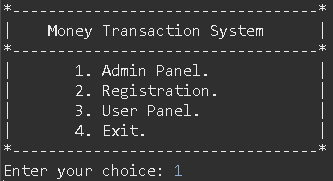
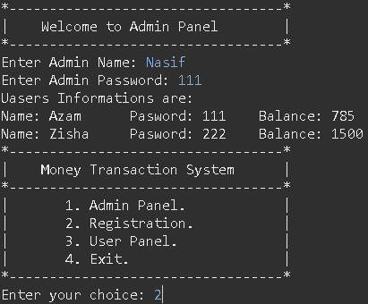
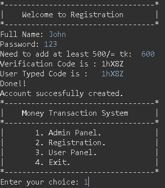
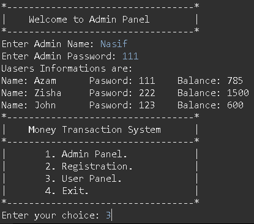
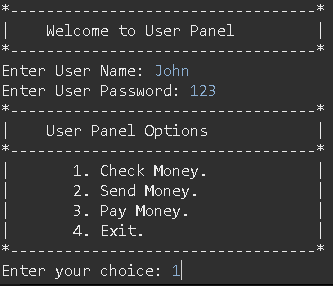
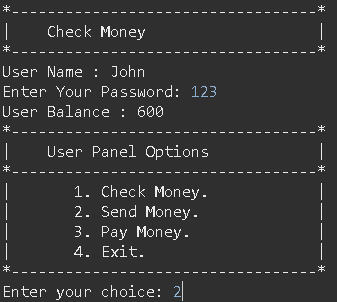
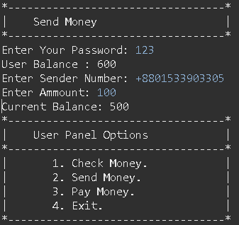

<h1 align="center">Cash Management Using OOP</h1>

The project refers to the implementation of object-oriented programming (OOP) principles with file management method to streamline and enhance the processes involved in managing cash flow and financial transactions within an organization. This approach leverages OOP concepts such as encapsulation, inheritance, and polymorphism to create modular, reusable, and maintainable code structures. Using OOP for cash management ensures a clear structure, reduces redundancy, and makes the system more adaptable to changes and expansions, ultimately leading to more efficient and effective financial management.

## Usages
- Transaction Handling.
- Account Management.
- Reporting and Analytics.
- Security and Access Control.
- Integration and Extensibility.
- File Management.
- Error Handling and Logging.

## Implementation

  
   
  <em>Figure 1: Home Page</em>

  
   
  <em>Figure 2: Admin Panel</em>

  
   
  <em>Figure 3: Registration</em>

  
   
  <em>Figure 4: Admin Panel to View New Registered User</em>

  
   
  <em>Figure 5: User Panel View</em>

  
   
  <em>Figure 6: User Panel Check Money View</em>

  
   
  <em>Figure 7: User Panel Send Money View</em>

  
   
  <em>Figure 8: Send Money Text File Management</em>

  
   
  <em>Figure 9: Admin Text File Management</em>

  
   
  <em>Figure 10: Send Money & Admin Recorded Text Files</em>

